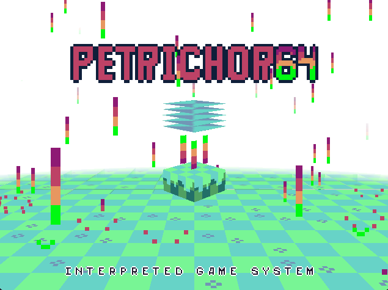

<h1>Petrichor64</h1>
<h4>The console that never was!</h4>

  <video src="https://github.com/user-attachments/assets/559cef3e-22a3-486e-b083-42cf337d9bf2" width="400" />

## Build

- As online is very limited it is disabled by default, enable with the `online_capable` flag.
- A headless build is possible as a server option but rather limited right now, build using `--no-default-features --features online_capable`

#### Windows

You'll want to build the resources.res file with something like:
`& "C:\Program Files (x86)\Windows Kits\10\bin\10.0.19041.0\x86\rc.exe" assets\resources.rc`

Currently added to an exe via third party tool so CLI means hasn't been tested

Executable:
`cargo build --release`

Executable with cart bundled:
`cargo build --release --features=include_auto`

##### MacOS (requires xcode)

Prerequisites:
`cargo install cargo-bundle`

**Apple Silicon**

Binary:
`cargo build --release --target aarch64-apple-darwin`

Application:
`cargo bundle --release --target aarch64-apple-darwin`

Application with cart bundled
`cargo bundle --features=include_auto --release --target aarch64-apple-darwin`

**Apple Intel (currently requires nightly)**

Binary:
`cargo build --release --target x86_64-apple-darwin`

Application:
`cargo bundle --profile release-nightly --target x86_64-apple-darwin`

Application with cart bundled:
`cargo bundle --features=include_auto --profile release-nightly --target x86_64-apple-darwin`

#### Linux / SteamDeck

Prerequisites:
`cargo install cargo-appimage`
`sudo apt install libfontconfig1-dev`

Build Standalone:
`cargo appimage`

Build with cart bundled
`cargo appimage --features=include_auto`

## Links

[Itch.io](https://makeavoy.itch.io/petrichor64)

[Trello](https://trello.com/b/qrrZ2lak)

[Ko-Fi](https://ko-fi.com/makeavoy)

Patreon???
